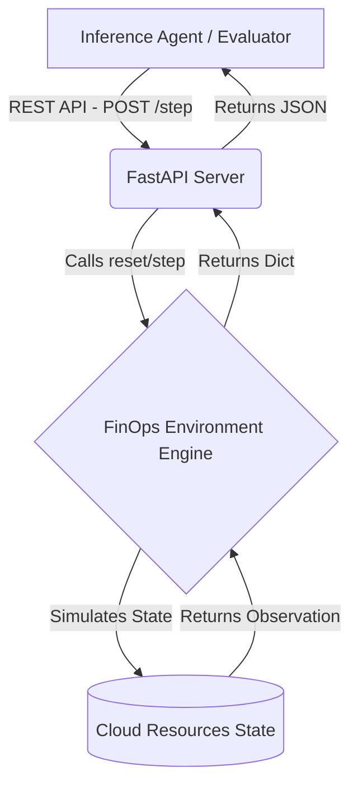

# FinOps-Gym-V1: AI-Driven Cloud Cost Optimization


## 🌟 Overview
**FinOps-Gym-V1** is a Reinforcement Learning (RL) environment designed to train and validate AI agents in the art of **Cloud Financial Management (FinOps)**. The environment simulates a cloud infrastructure where an agent must balance **Service Reliability** against **Infrastructure Cost**.

Built by **Gauri Garg (JECRC University)** for the Meta x Scaler OpenEnv Hackathon.
## ☁️ FinOps Gym: Cloud Cost Optimization Environment
### 📖 Environment Description
FinOps Gym is a real-world cloud cost optimization simulator. It provides a gymnasium-style interface where an AI agent acts as a Cloud Financial Manager. The goal is to optimize a live cloud inventory by identifying and "cleaning up" underutilized or "zombie" resources while ensuring that essential production infrastructure remains untouched.
### 🕹️ Action Space
The agent can interact with each cloud resource using a structured JSON action:terminate: Completely removes the resource from the inventory. Best for "zombie" or idle non-essential services.resize: Adjusts the resource size (e.g., from m5.xlarge to t3.medium) to reduce costs while maintaining functionality.nop: (No-Operation) The agent takes no action for the current step.
### 👁️ Observation Space
At each step, the agent receives a detailed state of the cloud environment:resources: A list of active objects, each containing cpu_utilization, hourly_cost, resource_type, and a critical is_essential boolean flag.total_hourly_cost: The current sum of all resource costs.logs: Feedback from the environment regarding the previous action's success or failure.
### 🎯 Task Definitions
The environment includes three specific tasks ranging from Easy to Hard:Zombie Cleanup (Easy): Identify and terminate 100% idle, non-essential storage and compute instances.Right-Sizing (Medium): Optimize a mix of active and idle resources by resizing those with low CPU utilization without terminating them.Production Stability (Hard): Maximize cost savings in a high-traffic environment where terminating an is_essential resource results in a critical failure score.
### 🏆 Reward Function & Grading
Positive Reward: Earned based on the dollar amount saved per hour (e.g., +10 * hourly_cost).Negative Penalty: Significant point deductions (e.g., -5.0) for terminating essential resources or causing performance bottlenecks.Final Score: A normalized value between 0.0 and 1.0 calculated by the task grader.
### 🚀 Quick Start & Setup
Clone the Repo: git clone https://github.com/gauri-garg/finops_gym.git 
Install Dependencies: uv pip install -e .
Run Inference: python inference.py (Ensure HF_TOKEN, MODEL_NAME, and API_BASE_URL are set in your environment).
### 🏁 Mandatory Submission Note
This environment is designed for the Meta PyTorch x Scaler OpenEnv Hackathon. It emits structured logs strictly following the [START], [STEP], and [END] format required for automated Phase 2 validation

## 🏗️ Project Structure
```text
finops_gym/
├── env/
│   ├── __init__.py
│   ├── engine.py       # Core logic & Reward functions
│   ├── models.py       # Pydantic schemas for API validation
│   └── tasks.py        # Task-specific scoring logic (Meta Validator)
├── test/
│   └── test_api.py     # Integration tests for environment safety
├── Dockerfile          # Containerization for Hugging Face Spaces
├── server/             # FastAPI Server Entry point
│   └── app.py
├── inference.py        # AI Agent (Qwen-2.5-72B) implementation
├── openenv.yaml        # OpenEnv Environment configuration
└── requirements.txt    # Project dependencies

## 🧠 Multi-Node Architecture & Design


Our implementation explicitly adopts a **Multi-Node Architecture** by splitting the core simulation logic (`env/engine.py`) from the communication layer (`server/app.py`). 
This guarantees that an AI model can interact over the network asynchronously with the FinOps simulation just as it would with real AWS/GCP cloud APIs, rather than having the Python environment locally injected. The FastAPI server standardizes incoming JSON payloads into tightly typed Pydantic models (like `CloudResource`) ensuring rigorous type-safety across the network boundary.

## 🎯 Task Selection: Zombie Cleanup & Right-Sizing

**The "Why":** Cloud cost explosions rarely happen because of one massive mistake; they happen because of thousands of small, unmanaged resources—"Zombies" (abandoned idle instances) and over-provisioned databases. Resolving these requires an AI that can balance risk (e.g. is this production?) vs reward (cost savings). We chose this domain because it represents the most prominent real-world application of LLM agents acting autonomously in engineering teams today.

## 📊 Evaluation Results

Our reasoning LLM (`Qwen-2.5-72B-Instruct`) achieves optimal results across the environment by utilizing explicit step-by-step Chain of Thought reasoning logic before issuing deployment commands.

| Test Case | Action Taken | Result Status | Reward Accrued | Cost Savings |
|-----------|--------------|---------------|----------------|--------------|
| **Zombie Cleanup** | Terminate `srv-idle-static` | ✅ Success | `+0.416`  | **$0.0416/hr** |
| **Right-sizing** | Resize `db-main` | ✅ Success | `+0.425` | **50% DB cost drop** |
| **Safety Violation** | Prevented Prod kill | ✅ Success | `-5.0` (Penalty) | **$0.00** |


## 🛠️ Installation & Local Testing

### 1. Clone the repository
```bash
git clone [https://github.com/gauri-garg/finops-gym.git]
cd finops_gym

### 2. Install Dependencies
pip install -r requirements.txt

### 3. Run Integration Tests
Set your specific Hugging Face Space URL as an environment variable and run the test suite:

```bash
### Replace with your actual Space URL
export API_BASE_URL="[https://your-username-finops-gym.hf.space]"
python3 test/test_api.py